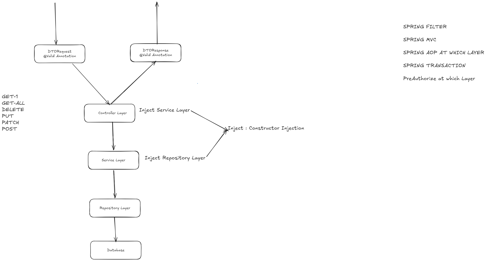

Level 1 : Beginner Level Code
CRUD + MySystem MySQL Setup

Project Structure Tree

```
├── controller
│   └── StudentController.java
│
├── service
│   └── StudentService.java
│
├── repository
│   └── StudentRepository.java
│
├── dto
│   └── student
│       ├── StudentRequest.java
│       └── StudentResponse.java
│
└── entity
    └── Student.java
        ├── studentId
        ├── name
        ├── email
        ├── age
        ├── course
        ├── departmentId
        ├── createdAt
        └── updatedAt    

```

TODO :
1. Write Code to Interface 
2. Jarkata Validation to DTO
3. Lombok -> Record Class

TODO Design Pattern
1. Facade DP
2. Builde DP


# Operation
1. GET-1
2. GET-ALL
3. POST
4. PUT
5. PATCH
5. DELETE


---
